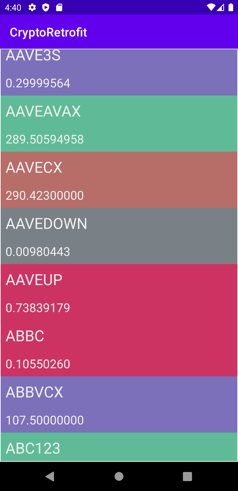
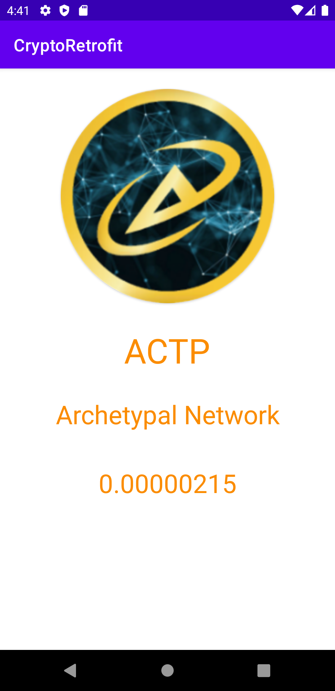
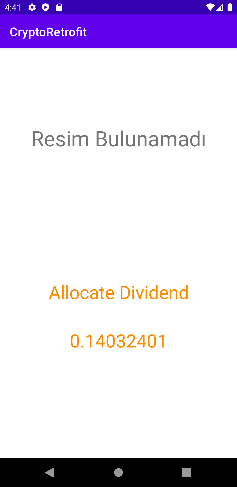

# Crypto-Retrofit-Java

### [Crypto API](https://p.nomics.com/cryptocurrency-bitcoin-api) sitesinden Retrofit kütüphanesini kullanarak aldığım veriler ile temel bir CryptoApp uygulamasıdır.

### It is a basic CryptoApp application with the data I got from the [Crypto API](https://p.nomics.com/cryptocurrency-bitcoin-api) site using the Retrofit library.

